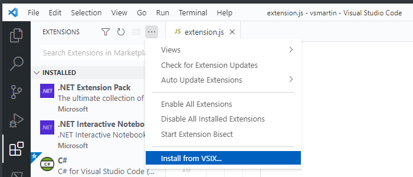
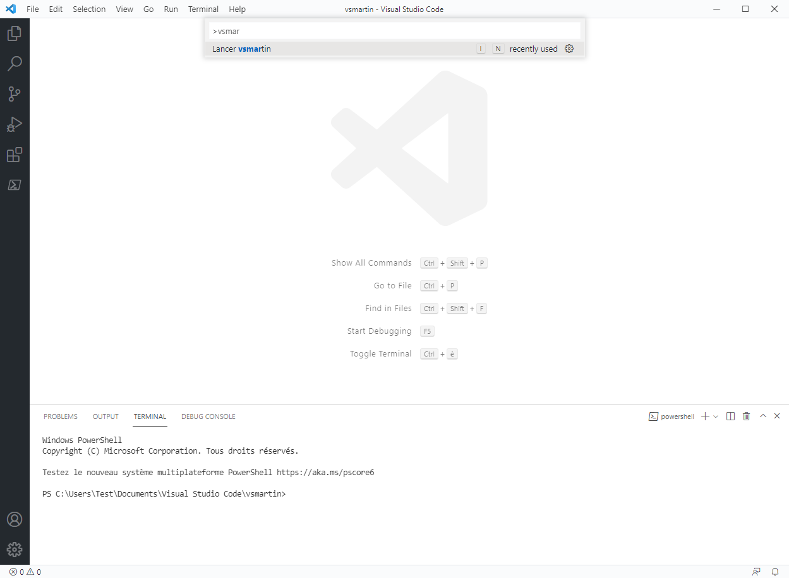
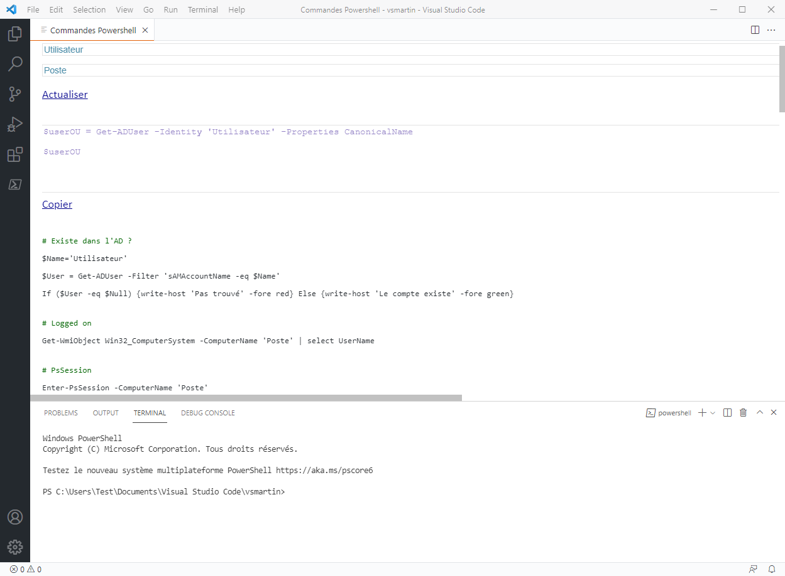

# My First Visual Studio Code Extension

vsmartin is a VS Code Extension in js witch display a html Webview

## Installation

Install from VISX or copy the repository into %USERPROFILE%\.vscode\extensions\vsmartin folder



## Usage

```python
Ctrl + Shift + P
Type vsmartin in the Search bar
```

## Screenshot





